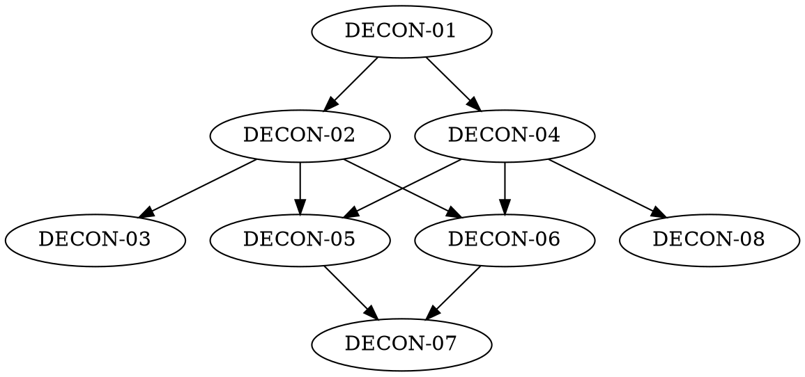

# cardpack Regeneration Pack — MANIFEST

**Source:** https://github.com/ImperialBower/cardpack.rs at commit `24ad604f4bb29e51de0c2835d149c8e0aea91854` (2026-07-18)
**Generated by:** the /deconstruct skill
**Contract:** an implementation in any language that satisfies every DECON
epic below and reproduces all golden vectors is a functional regeneration of
the source. Everything else — language, layout, internal design — is the
implementer's choice.

## Goal

A generic deck-of-cards domain: playing cards modeled as a rank facet plus a
suit facet, assembled into ordered piles that can be constructed, drawn from,
sorted, shuffled (including deterministically by seed), rendered and parsed
through defined string forms, localized into five languages, and extended by
consumers with entirely new deck vocabularies. Twelve deck types ship,
spanning the French family and its game variants, Tarot, and Skat.

## Epics & build order

| # | Epic | Scope (one line) | Depends on |
|---|---|---|---|
| 01 | `DECON-01_Card_Model_And_Ordering.md` | A card = rank facet + suit facet with precedence weights; canonical high-to-low, suit-major emission order | — |
| 02 | `DECON-02_Pile_Operations.md` | Piles as ordered card multisets: construct, draw (all-or-nothing), sort variants, extract/filter/map, self-validate | 01 |
| 03 | `DECON-03_Shuffling_And_Determinism.md` | Shuffle preserves the multiset; seeded shuffle is deterministic per seed; caller-supplied randomness is the portability escape hatch | 02 |
| 04 | `DECON-04_Formats_Parsing_And_Encoding.md` | Index strings, symbol strings, forgiving round-trip parsing, blank token, numeric interop encoding, serialization round-trips, error contract | 01 |
| 05 | `DECON-05_French_Deck_Family.md` | French 54 and its derivatives: Standard52, Short 36, Spades, Euchre 24/32, Pinochle 48 (Ten outranks King, duplicates), Canasta 108, Razz (Ace-low) | 01–04 |
| 06 | `DECON-06_Tarot_And_Skat.md` | Tarot 78 (22 Major + 56 Minor Arcana, trump precedence) and Skat 32 (German rank/suit names) | 01–04 |
| 07 | `DECON-07_Localization.md` | Card, rank, and suit names resolve per locale: en-US, de, fr, la, tlh; confidence tiering for draft locales | 05, 06 |
| 08 | `DECON-08_Extension_And_Registry.md` | Consumers can author new deck vocabularies with the same machinery as shipped decks; a registry enumerates and instantiates every deck kind | 01–04 |

## Perspectives taxonomy

| Perspective | Rating | Evidence | Boundary invariant / characteristic |
|---|---|---|---|
| God-mode | Full | Deck-authoring machinery is public and documented as the extension path (worked example deck in crate docs) | Consumers can define new deck vocabularies with the same machinery shipped decks use |
| Administrative | Full | A deck-kind registry enumerates, names, and instantiates all shipped decks | Operators can enumerate and instantiate every deck kind without write access to vocabulary definitions |
| User/client | Full | Pile mutations act on owned instances; cards are value-copies | Users mutate only their own pile; deck identity and vocabulary stay immutable |
| Observer/operator | Partial | Only warning/error emissions on malformed input; routine domain events (shuffle, draw, deal) are silent | Observation never mutates domain state; gap: no tracing of routine events |
| Performant *(lens)* | Full *(informative)* | Regression-tracked draw/shuffle/combo benchmarks; vocabulary construction is compile-time work in the original | Characteristic, informative unless SD-flagged |
| Flexibility *(lens)* | Full *(informative)* | Runs from full OS environments to bare-metal (no allocator-free mode; allocation required) and browsers; capabilities (i18n, color, YAML, serialization) are optional layers | Characteristic, informative unless SD-flagged |

## Coverage

| Observable behavior | Epic | Notes |
|---|---|---|
| Card = rank facet + suit facet, each with name, precedence weight, index char, symbol | 01 | |
| Canonical emission order: high-to-low, suit-major | 01 | |
| Deck composition per type (counts, suits, ranks, duplicates, jokers) | 05, 06 | vectors per deck |
| Pinochle Ten-outranks-King; Razz Ace-low ascending | 05 | |
| Tarot Major/Minor Arcana trump precedence | 06 | |
| Construct deck / parse pile from string / registry instantiation | 02, 04, 08 | |
| Draw first/last/n/random; all-or-nothing on insufficient cards | 02 | |
| Sort suit-major (default) and rank-major | 02 | |
| Extract ranks/suits, filter by pip type, combinations, map by rank/suit | 02 | |
| Deck self-validation (shuffle→sort round trip; string round trip) | 02 | cross-ref 08's automatic capability grant |
| Shuffle preserves multiset; seeded shuffle deterministic per seed | 03 | SD-01 |
| Index string / symbol string / forgiving parse round-trip incl. blank token | 04 | |
| Numeric interop encoding of cards (poker-evaluator compatible) | 04 | SD-02 |
| Structured serialization round-trips; YAML card lists | 04 | |
| Error contract (invalid index, not enough cards, …) | 04 | SD-04 |
| Localized names in en-US, de, fr, la, tlh | 07 | draft tiering noted |
| Consumer-defined deck vocabularies (worked example) | 08 | |
| Colored terminal display | 04 | optional capability |

## Out of scope

| Item | Why |
|---|---|
| Ganjifa decks (Mughal, Dashavatara) | Documented design only (`EPIC-02` in source repo); zero implementation exists — nothing to extract vectors from. A rebuilder wanting them should consult that design doc. |
| Poker hand evaluation | Not in the library; external evaluator interop is covered only via the numeric encoding (04) |
| Performance parity | Lens finding is informative (SD-03: not binding) |
| Platform matrix (no_std, wasm, MSRV, CI) | Engineering context, non-normative — see `APPENDIX_Engineering_Constraints.md` |

## Spec decisions index

| ID | Epic | Decision |
|---|---|---|
| SD-01 | 03 | Seeded-shuffle permutations: relaxed — the determinism *property* is normative; exact permutation vectors are informative (original disclaims cross-version stability itself) |
| SD-02 | 04 | Numeric interop encoding: pinned — normative for implementations claiming poker-evaluator interop; the capability itself is optional |
| SD-03 | — | Performance and flexibility lens findings are informative, not binding |
| SD-04 | 04 | Error contract: the *set* of detectable error conditions is normative; error taxonomy/shape is implementer's choice (original carries two inconsistent contracts for one condition) |
| SD-05 | 07 | Draft-locale strings (fr, la, tlh): informative — `en-US` and `de` are normative; the source repo itself marks fr/la/tlh draft, pending native-speaker/subject-matter review |

## Drift log

*(empty — initial extraction)*
