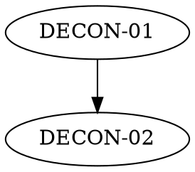

# /deconstruct Skill Implementation Plan

> **For agentic workers:** REQUIRED SUB-SKILL: Use superpowers:subagent-driven-development (recommended) or superpowers:executing-plans to implement this plan task-by-task. Steps use checkbox (`- [ ]`) syntax for tracking.

**Goal:** Build the `/deconstruct` skill (SKILL.md + references) that distills a codebase into a portable regeneration pack — language-agnostic DECON epics plus golden vectors — then validate it with a first real run on cardpack.rs.

**Architecture:** A user-level Claude skill at `~/.claude/skills/deconstruct/` mirroring `/epic`'s layout (SKILL.md + `references/`). The skill defines a four-phase pipeline (Survey → Map → Generate → Audit) with one user checkpoint at the Map stage. Validation is a lab-rat run producing `docs/deconstruct/` in cardpack.rs, with vectors extracted by a committed Rust example.

**Tech Stack:** Markdown skill files; Rust 2024 / cargo for the lab-rat dumper (`serde_json` dev-dependency); subagent fan-out for surveys.

**Spec:** `docs/superpowers/specs/2026-07-18-deconstruct-skill-design.md` (approved). Where this plan and the spec disagree, the spec wins.

## Global Constraints

- **Never run state-changing git commands** (user's global CLAUDE.md). Every "Commit" step means: *suggest the exact commands for the user to run*, then continue. Read-only git (`status`, `diff`, `log`, `rev-parse`) is fine.
- Skill files live at `~/.claude/skills/deconstruct/` (absolute: `/Users/christoph/.claude/skills/deconstruct/`).
- Lab rat repo: `/Users/christoph/src/autobot/cardpack.rs`; pack output dir: `docs/deconstruct/`.
- DECON numbering: `DECON-NN_Snake_Case.md`, zero-padded, from `01`, ordered by build order.
- Everything in the pack outside `## Provenance` sections must be language-neutral (no Rust type names, no crate names, no `const fn` talk).
- Vector JSON: UTF-8, LF, 2-space indent, deterministic content — **no timestamps, no unordered iteration** — byte-identical across runs at the same commit.
- Vector envelope: `{"epic": "DECON-NN", "behavior": "<slug>", "data": ...}`. The source commit is pinned once in MANIFEST.md, not per file (keeps files stable across doc-only commits).
- All epic Status rows are `Planned` — a regeneration spec describes work not yet done.

---

### Task 1: SKILL.md

**Files:**
- Create: `/Users/christoph/.claude/skills/deconstruct/SKILL.md`

**Interfaces:**
- Produces: the skill entry point. References (by exact filename) `references/methodology.md`, `references/manifest-template.md`, `references/decon-epic-template.md`, `references/vectors-readme-template.md` — created in Tasks 2–3.

- [ ] **Step 1: Write the file with exactly this content**

````markdown
---
name: deconstruct
description: Distill an existing codebase into a portable regeneration pack — language-agnostic DECON epics in the /epic house style plus golden test vectors extracted by running the original code — so its functionality can be rebuilt by people or agents in any language without inheriting the original's programmatic design choices. Use when the user types `/deconstruct [subsystem]` or asks to "deconstruct this codebase", "distill this repo into epics", "make a regeneration spec", "reverse-engineer a spec from this code", "write specs so another team or agent can rebuild this" — even if they never say the word deconstruct. Do NOT trigger for forward-looking feature design (that is /epic), teaching material or exercises (that is /codebase-kata), or kernel-purity assessment (that is /domain-kernel).
---

# Deconstruct

Turn a working codebase into a **regeneration pack**: a self-contained folder
of language-agnostic epics plus machine-extracted golden vectors, sufficient
for a person or agent to rebuild the functionality in any language, free of
the original's design choices.

`/epic` goes design → code. `/deconstruct` is its inverse: code → design.
Citations into the source prove a behavior is real; they never bind the
rebuilder.

## Usage

- `/deconstruct` — deconstruct the whole repo.
- `/deconstruct <subsystem>` — scoped run: produce or update only the epics
  covering `<subsystem>`, then re-derive the manifest coverage table.

**Update mode:** if a pack already exists (a `deconstruct/MANIFEST.md` under
the repo's docs folder), never clobber it. Refresh vectors at the current
commit, reconcile epic text against current behavior, and record drift in the
manifest's Drift log. Never renumber existing DECON epics.

## The pack

Write into `<docs-dir>/deconstruct/` (detect the repo's docs folder the same
way /epic does — prefer wherever design markdown already lives; default
`docs/`):

    docs/deconstruct/
      MANIFEST.md                       ← index & entry point
      DECON-01_Name.md …                ← epics, own numbering, build order
      APPENDIX_Engineering_Constraints.md
      vectors/
        README.md                       ← vector format contract
        <epic-slug>/*.json              ← golden vectors per epic

The pack must be portable: copy the folder out and hand it to any agent —
nothing in it may depend on access to the source repo.

## What you must do when invoked

**Before writing anything**, read `references/methodology.md` in this skill
dir, and `~/.claude/skills/epic/references/methodology.md` — the /epic voice
and kata framing carry over; this skill's methodology defines the deltas
(the "deconstruct profile").

### Phase 1 — Survey

Fan out subagents over four signals; keep the conclusions, not the file
dumps:

1. **Public surface** — every observable capability: the domain's things,
   operations, orderings, formats, locales.
2. **Test mining** — what the tests promise; note coverage gaps.
3. **Docs mining** — README, CHANGELOG, design docs: what was intended.
4. **Perspective analysis** — which actor perspectives the code supports
   (god-mode / administrative / user-client / observer-operator, plus any
   repo-specific ones), each rated Full / Partial / Absent with evidence,
   behind what boundary invariants. For observer: which domain events are
   visible without side effects.

Merge into a **behavior inventory**: each entry tagged `domain-essential` or
`implementation-accident` (litmus test in the methodology). Where the signals
disagree — or an observable output hangs off an accidental choice — record a
**spec decision** flag; never silently resolve.

### Phase 2 — Map (the one checkpoint)

Cluster the inventory into epics with a dependency order. Draft `MANIFEST.md`
from `references/manifest-template.md`. Then pause ONCE: present the epic
list, per-epic scope, out-of-scope rows, and the perspectives taxonomy via
AskUserQuestion. The user's approval (with edits) is the gate. No other
checkpoints — after this, generate everything.

### Phase 3 — Generate

For each epic, in dependency order:

1. Write `DECON-NN_Name.md` from `references/decon-epic-template.md`,
   following the deconstruct profile.
2. Extract golden vectors by **running the original code**: write a dumper
   program in the source language, using only the public API, that
   serializes the epic's observable behaviors to JSON under
   `vectors/<epic-slug>/`. The dumper is committed to the source repo (e.g. a
   Rust example) so vectors stay regenerable. **Never hand-write vector
   values.** If you cannot run the code, say so and stop — do not fabricate.
3. Maintain `vectors/README.md` from `references/vectors-readme-template.md`
   (create with the first epic; extend its file table with each subsequent
   one).

Also write `APPENDIX_Engineering_Constraints.md`: platform and engineering
traits (e.g. no_std, wasm targets, MSRV, performance posture, CI matrix) as
context for rebuilders, explicitly marked non-normative.

### Phase 4 — Audit

1. **Coverage** — walk the public surface again; every observable behavior
   must map to an epic or an explicit out-of-scope row in the manifest.
2. **Anti-constraint lint** — search epic bodies for source-language type
   names, crate names, and idioms outside `## Provenance` sections; rewrite
   neutrally or move into Provenance.
3. **Perspective consistency** — every epic's `## Perspectives` section uses
   only perspectives defined in the manifest taxonomy (or N/A); every
   non-Absent perspective in the taxonomy is addressed by at least one epic.

Fix findings, then report the audit results in your final summary.

## Rules

- **Essential vs accident.** If a correct rebuild in another language would
  be forced to make the same choice to preserve observable behavior, it is
  domain-essential; otherwise it is an accident and must not appear as a
  requirement.
- **Vectors are extracted, never authored.**
- **Provenance is non-normative.** `path:line` citations prove existence;
  they never bind.
- **Name the freedoms.** Every epic lists implementer's-choice items in
  `## Not specified`. Silence is ambiguous; a named freedom is not.
- **Boundaries as invariants.** Perspective boundaries are domain rules
  ("consumers cannot alter deck vocabulary"), never mechanisms ("const").
- **Absences are recorded** — an unsupported perspective or uncovered
  behavior is written down, so a rebuilder can tell design from omission.
- **Honesty.** /epic's honesty rules apply; all Status rows are `Planned`.
- **Git.** Suggest commit commands; never run state-changing git yourself.
````

- [ ] **Step 2: Verify**

Run: `grep -c "Phase" ~/.claude/skills/deconstruct/SKILL.md && grep -n "TBD\|TODO\|FIXME" ~/.claude/skills/deconstruct/SKILL.md`
Expected: a nonzero count from the first grep; **no output** (exit 1) from the second.

- [ ] **Step 3: Commit (suggest to user)**

If `~/.claude` is version-controlled by the user, suggest:
```bash
git -C ~/.claude add skills/deconstruct/SKILL.md && git -C ~/.claude commit -m "feat(deconstruct): add skill entry point"
```
Otherwise skip silently.

---

### Task 2: references/methodology.md

**Files:**
- Create: `/Users/christoph/.claude/skills/deconstruct/references/methodology.md`

**Interfaces:**
- Consumes: SKILL.md's phase names (Survey/Map/Generate/Audit) and rule names from Task 1.
- Produces: the profile table, the essential/accident litmus, the SD-NN spec-decision format, the perspectives rubric, vector conventions, dumper guidance — referenced by templates in Task 3 and by every generated epic.

- [ ] **Step 1: Write the file with exactly this content**

````markdown
# Deconstruct methodology — the profile

Read `~/.claude/skills/epic/references/methodology.md` first. Everything
there about voice, kata framing, and honesty applies. This file defines the
deltas for regeneration specs.

## The deconstruct profile (deltas vs /epic)

| /epic convention | deconstruct profile |
|---|---|
| Status rows reflect landed work | All rows `Planned` — the spec describes work not yet done |
| Design carries ```rust API sketches | Language-neutral prose, tables, pseudocode; rationale states the *domain constraint*, never the original mechanism |
| Domain map: concept → code construct | Concept → required behavior → vector file |
| Verification: ```bash of exact commands | Contract clause: "any implementation must reproduce `vectors/<slug>/*.json`" + prose exit criteria |
| `path:line` citations are normative | Citations live only in `## Provenance (non-normative)` |
| — | `## Perspectives`: per-slice actor boundaries |
| — | `## Not specified (implementer's choice)`: named freedoms |
| — | `## Spec decisions`: SD-NN flags |

## Litmus: domain-essential vs implementation-accident

Ask: **"Would a correct rebuild in another language be forced to make the
same choice to preserve observable behavior?"** Yes → essential (spec it).
No → accident (omit it, or name it as a freedom).

Examples (cardpack):

- Weak Ganjifa suits rank pips inverted (`A > 2 > … > 10`) → **essential**.
- Implementing that as a second rank ladder with inverted weight integers →
  **accident**.
- Card names localize into 5 locales with specific translated strings →
  **essential** (observable).
- The fluent-templates crate and `.ftl` file layout → **accident**.

**The coupled case:** some observable outputs are consequences of accidental
choices — e.g. the exact permutation from a seeded shuffle depends on which
RNG the original picked. Record a spec decision: **pin** (the vector is
normative; rebuilds are bit-compatible) or **relax** (the *property* —
"same seed ⇒ same permutation, uniform over seeds" — is normative and the
vector is informative). State which was chosen and why.

## Spec decision format

In the epic body, at the point of relevance:

> **Spec decision SD-NN:** <the question>. **Options:** <A> / <B>.
> **Chosen:** <one> — <one-line why>.

Number SD-NN globally across the pack; index every flag in the manifest.

## Perspectives

Canonical taxonomy (extend with repo-specific perspectives as discovered):

- **God-mode** — central control over what the domain *is*: definitions,
  vocabularies, rank ladders.
- **Administrative** — operates and supports the domain without redefining
  it (registries, configuration, lifecycle).
- **User/client** — consumes functionality with bounded access, unable to
  corrupt the underlying domain.
- **Observer/operator** — read-only insight into domain activity (OTel-style
  telemetry: traces, metrics, logs) without the ability to affect it.

Rating rubric (manifest carries the ratings, with evidence):

- **Full** — the perspective has a complete, bounded interface and its
  boundary invariants hold everywhere.
- **Partial** — some support exists; name the gaps concretely.
- **Absent** — no support; record it explicitly so a rebuilder can tell
  design from omission.

Phrase boundaries as **domain invariants**, never mechanisms: write
"consumers cannot alter the deck vocabulary", not "deck consts are
immutable"; write "observation must not mutate domain state", not "we log
via the log crate".

## Vector conventions

- JSON, UTF-8, LF line endings, 2-space indent, trailing newline.
- Envelope: `{"epic": "DECON-NN", "behavior": "<slug>", "data": ...}`.
  The source commit is pinned once in MANIFEST.md, not per file.
- Deterministic: no timestamps, no unordered-map iteration, fixed seeds
  (list the seeds in the epic). Byte-identical across runs at one commit.
- Arrays appear in domain order (e.g. deck order), not alphabetical.
- One file per behavior cluster; typical clusters: `composition` (the full
  card list, in order), `ordering` (rank/suit precedence), `roundtrip`
  (parse/format pairs), `locales` (localized names), `seeded-shuffle`
  (seed → permutation).

## Dumper guidance

- Written in the source language, importing the code **as a consumer
  would** — public API only, no internal modules.
- Lives in the source repo (for Rust: an example, run via
  `cargo run --example <name>`), committed, so vectors regenerate when the
  source moves.
- Writes files under the pack's `vectors/` dir; prints one line per file
  written; exits nonzero on any failure.

## Numbering, naming, update mode

- `DECON-NN_Snake_Case.md`, zero-padded from `01`, ordered by build order
  (foundations first). Sub-letter `NNa` for a follow-on, as in /epic.
- Update mode: regenerate vectors at the current commit; if any file
  changes, add a Drift log row in the manifest (commit range → behavior
  change) and reconcile the affected epic text. Never renumber.
````

- [ ] **Step 2: Verify**

Run: `grep -n "TBD\|TODO\|FIXME" ~/.claude/skills/deconstruct/references/methodology.md; grep -c "SD-NN" ~/.claude/skills/deconstruct/references/methodology.md`
Expected: no matches from the first grep; count ≥ 2 from the second.

- [ ] **Step 3: Commit (suggest to user, same pattern as Task 1)**

---

### Task 3: The three templates

**Files:**
- Create: `/Users/christoph/.claude/skills/deconstruct/references/decon-epic-template.md`
- Create: `/Users/christoph/.claude/skills/deconstruct/references/manifest-template.md`
- Create: `/Users/christoph/.claude/skills/deconstruct/references/vectors-readme-template.md`

**Interfaces:**
- Consumes: section names and SD-NN / perspectives formats from Task 2's methodology.
- Produces: the skeletons Phase 2/3 copy from. Section headings here are the canonical ones the Phase 4 audit checks against.

- [ ] **Step 1: Write `decon-epic-template.md` with exactly this content**

````markdown
# DECON-NN: Title

> **Regeneration spec.** Describes functionality to rebuild, not work landed
> in this repo. Nothing here mandates the original's implementation; source
> citations appear only under Provenance and are non-normative.

## Context
<!-- Where this slice sits in the domain; what this epic explicitly does NOT
cover. Language-neutral. No source citations here. -->

## Status
| Component | Status |
|---|---|
| <component> | Planned |

## Goals
<!-- Bulleted intent; load-bearing nouns bold. -->

## Scope
<!-- The concrete rules a rebuild must obey. -->

## Domain map
| Concept | Required behavior | Vectors |
|---|---|---|
| <concept> | <behavior> | `vectors/<slug>/<file>.json` |

## Design
<!-- Language-neutral: prose, tables, pseudocode. Rationale = the domain
constraint ("weak suits invert pip order"), never the original mechanism. -->

## Perspectives
| Perspective | May | Must not | Boundary invariant |
|---|---|---|---|
| <taxonomy name> | <capabilities> | <limits> | <invariant> |
<!-- Use only perspectives from the manifest taxonomy. One-line N/A for
irrelevant ones: "Administrative: N/A for this slice." -->

## Work Items
### Phase 0 — <name>
- [ ] **0a.** <implementation-agnostic task; names the vector or criterion
  that proves it>
<!-- Test-first ordering; phases grouped by dependency, as in /epic. -->

## Test Plan
<!-- Given/When/Then per behavior; each references its vector file. -->

## Not specified (implementer's choice)
<!-- Named freedoms: memory layout, error style, module structure, … -->

## Spec decisions
<!-- SD-NN flags relevant to this epic, per methodology format — or "None." -->

## Verification
Any implementation must reproduce every file under `vectors/<epic-slug>/`:
1. <numbered exit criteria>

## Dependencies
**Builds on:** DECON-NN. **Blocks:** DECON-NN.

## Provenance (non-normative)
<!-- `path:line` citations at the manifest's pinned commit, proving each
behavior exists in the original. Never binding on a rebuild. -->
````

- [ ] **Step 2: Write `manifest-template.md` with exactly this content**

````markdown
# <Project> Regeneration Pack — MANIFEST

**Source:** <repo url or path> at commit `<hash>` (<YYYY-MM-DD>)
**Generated by:** the /deconstruct skill
**Contract:** an implementation in any language that satisfies every DECON
epic below and reproduces all golden vectors is a functional regeneration of
the source. Everything else — language, layout, internal design — is the
implementer's choice.

## Goal
<!-- One paragraph: what this domain is and does. -->

## Epics & build order
| # | Epic | Scope (one line) | Depends on |
|---|---|---|---|
| 01 | `DECON-01_Name.md` | <scope> | — |



## Perspectives taxonomy
| Perspective | Rating | Evidence | Boundary invariant |
|---|---|---|---|
| God-mode | Full/Partial/Absent | <evidence> | <invariant> |
| Administrative | … | … | … |
| User/client | … | … | … |
| Observer/operator | … | … | … |

## Coverage
| Observable behavior | Epic | Notes |
|---|---|---|
<!-- Every public behavior maps to an epic — or appears in Out of scope. -->

## Out of scope
| Item | Why |
|---|---|

## Spec decisions index
| ID | Epic | Decision |
|---|---|---|

## Drift log
<!-- Update mode only: | commit range | behavior change | epics touched | -->
````

- [ ] **Step 3: Write `vectors-readme-template.md` with exactly this content**

````markdown
# Golden vectors — format contract

Every file under `vectors/` was machine-extracted from the source repo at
the commit pinned in `../MANIFEST.md`, by running `<dumper command>` in the
source repo. Values are never hand-written. Regenerating at the same commit
must reproduce every file byte-identically.

## Envelope

```json
{ "epic": "DECON-NN", "behavior": "<slug>", "data": {} }
```

## Determinism rules

UTF-8, LF, 2-space indent, trailing newline. No timestamps. Arrays in domain
order. Fixed seeds (listed in the owning epic). Byte-identical across runs.

## Consuming

An implementation passes a vector iff computing the described behavior
yields data deep-equal to the file's `data` field. Field names inside `data`
describe the domain (defined per-file in the owning epic's Domain map);
they do not prescribe your API.

## Files
| File | Epic | Behavior |
|---|---|---|
| `<epic-slug>/<file>.json` | DECON-NN | <one line> |
````

- [ ] **Step 4: Verify**

Run: `ls ~/.claude/skills/deconstruct/references/ && grep -L "Provenance\|Perspectives" ~/.claude/skills/deconstruct/references/decon-epic-template.md`
Expected: four files listed; no output from the `grep -L` (both headings present).

- [ ] **Step 5: Commit (suggest to user, same pattern as Task 1)**

---

### Task 4: Skill self-check against spec

**Files:**
- Read: all four files under `~/.claude/skills/deconstruct/`
- Read: `docs/superpowers/specs/2026-07-18-deconstruct-skill-design.md`

**Interfaces:**
- Consumes: everything from Tasks 1–3.
- Produces: a green light for the lab-rat run.

- [ ] **Step 1: Spec coverage walk**

For each numbered Settled decision (1–6) and each pipeline phase in the spec, point to the SKILL.md or reference section that implements it. Fix any gap by editing the skill files, not by reinterpreting the spec.

- [ ] **Step 2: Placeholder & overlap scan**

Run: `grep -rn "TBD\|TODO\|FIXME" ~/.claude/skills/deconstruct/`
Expected: no matches.
Then read the frontmatter `description` fields of `epic`, `codebase-kata`, and `domain-kernel` and confirm `/deconstruct`'s description claims none of their triggers (forward design, teaching, purity audit are all explicitly excluded).

- [ ] **Step 3: Dry trigger test**

Confirm the description fires for: "distill this repo into epics for regeneration", "make a spec another agent could rebuild this from" — and does not fire for: "write an EPIC for adding a new deck" (that's /epic), "make a kata from this repo" (that's /codebase-kata).

---

### Task 5: Lab-rat run — Phases 1–2 on cardpack.rs (Survey + Map + checkpoint)

**Files:**
- Create: `docs/deconstruct/MANIFEST.md` (draft, from the manifest template)
- Scratchpad: behavior inventory notes

**Interfaces:**
- Consumes: the finished skill (Tasks 1–4).
- Produces: the approved epic map that Task 6 generates from.

- [ ] **Step 1: Invoke the skill for real** — from here on, `/deconstruct`'s own SKILL.md instructions govern; this task just pins the checkpoints.

- [ ] **Step 2: Phase 1 survey** — dispatch the four survey subagents (public surface, test mining, docs mining, perspective analysis) per SKILL.md. Merge results into a behavior inventory in the scratchpad with essential/accident tags and any SD flags (expected flag: seeded-shuffle pin-vs-relax, per the methodology's coupled case).

- [ ] **Step 3: Phase 2 map** — cluster into DECON epics with build order and draft `docs/deconstruct/MANIFEST.md`. Illustrative shape (the actual survey wins — do not force this): foundations (card/rank/suit/deck model) → deck operations (draw, sort, shuffle, seeded shuffle) → parsing & formatting → French family → Tarot → Skat → Ganjifa → localization.

- [ ] **Step 4: The one checkpoint** — present the epic list, scopes, out-of-scope rows, and perspectives taxonomy via AskUserQuestion. Apply edits; get approval.

- [ ] **Step 5: Commit (suggest to user)**

```bash
git add docs/deconstruct/MANIFEST.md && git commit -m "docs: add deconstruct pack manifest (approved epic map)"
```

---

### Task 6: Lab-rat run — Phase 3 (Generate epics + dumper + vectors)

**Files:**
- Create: `docs/deconstruct/DECON-*.md` (one per approved epic)
- Create: `docs/deconstruct/APPENDIX_Engineering_Constraints.md`
- Create: `docs/deconstruct/vectors/README.md` + `docs/deconstruct/vectors/<slug>/*.json`
- Create: `examples/deconstruct_vectors.rs`
- Modify: `Cargo.toml` (add `serde_json` dev-dependency + `[[example]]` entry)

**Interfaces:**
- Consumes: the approved manifest from Task 5.
- Produces: the complete pack for Task 7's audit.

- [ ] **Step 1: Register the dumper example**

In `Cargo.toml`, add to the `[target.'cfg(not(target_os = "none"))'.dev-dependencies]` table:

```toml
serde_json = "1"
```

and append:

```toml
[[example]]
name = "deconstruct_vectors"
required-features = ["std", "i18n"]
```

- [ ] **Step 2: Write the dumper skeleton at `examples/deconstruct_vectors.rs`**

```rust
//! Dumps golden vectors for the /deconstruct regeneration pack.
//! Public API only — this program is a consumer of the crate.
use std::fs;
use std::path::Path;

fn write_vector(epic: &str, slug_dir: &str, behavior: &str, data: serde_json::Value) {
    let root = Path::new("docs/deconstruct/vectors").join(slug_dir);
    fs::create_dir_all(&root).expect("mkdir vectors dir");
    let envelope = serde_json::json!({ "epic": epic, "behavior": behavior, "data": data });
    let path = root.join(format!("{behavior}.json"));
    fs::write(&path, serde_json::to_string_pretty(&envelope).expect("serialize") + "\n")
        .expect("write vector");
    println!("wrote {}", path.display());
}

fn main() {
    dump_foundations();
    // one dump_<slug>() per approved epic, added below
}
```

Then, per approved epic, add a `dump_<slug>()` function that builds the relevant decks through the **public API** (e.g. `let pile: Pile<Standard52> = Standard52::deck();` via `cardpack::prelude` and the `Decked` trait — exact constructors per the Phase 1 survey) and serializes the epic's behavior clusters (composition, ordering, roundtrip, locales, seeded-shuffle) per the vector conventions. `serde_json::json!` maps preserve insertion order only via `Value::Object` when the `preserve_order` feature is off — so build `data` from arrays and explicit key order; verify determinism in Step 4.

- [ ] **Step 3: Generate the epics** — write each `DECON-NN_*.md` from the template, plus the appendix (no_std/alloc discipline, wasm32 + getrandom backend note, MSRV 1.85, CI matrix — all non-normative), extending `vectors/README.md`'s file table as you go.

- [ ] **Step 4: Extract and verify vectors**

Run: `cargo run --example deconstruct_vectors` — expect one `wrote …` line per vector file, exit 0.
Then determinism: `cp -r docs/deconstruct/vectors /tmp-check && cargo run --example deconstruct_vectors && diff -r /tmp-check docs/deconstruct/vectors` (use the session scratchpad dir, not literal `/tmp-check`).
Expected: no diff. If diff, hunt the nondeterminism (map iteration, seeds) before proceeding.

- [ ] **Step 5: Quality gate**

Run: `cargo test --all && cargo clippy --all-targets -- -D warnings`
Expected: green — the dumper example must not break the lab rat's own CI standards.

- [ ] **Step 6: Commit (suggest to user)**

```bash
git add Cargo.toml examples/deconstruct_vectors.rs docs/deconstruct/ && git commit -m "docs: add deconstruct regeneration pack (epics + golden vectors + dumper)"
```

---

### Task 7: Lab-rat run — Phase 4 audit + acceptance

**Files:**
- Modify: `docs/deconstruct/MANIFEST.md` (final coverage table), any epic the audit flags

**Interfaces:**
- Consumes: the complete pack from Task 6.
- Produces: the accepted pack; the spec's acceptance checklist, checked.

- [ ] **Step 1: Coverage pass** — re-walk cardpack's public surface (a fresh subagent, prelude-first) against the manifest coverage table; add missing rows as epic mappings or explicit out-of-scope entries.

- [ ] **Step 2: Anti-constraint lint**

Run: `grep -rnE "\b(Pip|BasicCard|Pile|Decked|const fn|impl |Vec<|Rust|crate)\b" docs/deconstruct/DECON-*.md`
Expected: hits ONLY inside `## Provenance (non-normative)` sections (verify each hit's section by eye). Rewrite or relocate any violation.

- [ ] **Step 3: Perspective consistency** — check each epic's Perspectives table uses only manifest-taxonomy names (or N/A), and each non-Absent taxonomy row is addressed by ≥1 epic.

- [ ] **Step 4: Spot check (spec acceptance #5)** — dispatch a subagent with access ONLY to `docs/deconstruct/` (instruct it: no reading outside that dir) and ask: "What cards are in a Mughal Ganjifa deck and how do weak suits rank?" Expected: 96 cards, 8 suits × 12 (King, Vizier, pips), and weak-suit pip inversion described correctly.

- [ ] **Step 5: Acceptance checklist** — confirm all six spec acceptance items and report results honestly, including any failures.

- [ ] **Step 6: Final commit (suggest to user)**

```bash
git add docs/deconstruct/ && git commit -m "docs: deconstruct pack audit fixes"
```

---

## Self-review notes

- Spec coverage: decisions 1–6 → Task 1 (SKILL.md rules/phases), Task 2 (litmus, SD format, perspectives rubric, vector conventions), Task 3 (templates carrying Perspectives/Not-specified/Provenance sections), Tasks 5–7 (acceptance run). Update mode + scoped runs → SKILL.md Usage. Edge cases → SKILL.md Usage + methodology Update mode.
- Placeholder scan: template files intentionally contain `<angle-bracket>` slots — they are templates; the plan's own steps contain full content.
- Consistency: section names in templates match SKILL.md Phase 4 checks and methodology profile table (`Perspectives`, `Not specified (implementer's choice)`, `Spec decisions`, `Provenance (non-normative)`); envelope shape identical in methodology, vectors README template, and dumper skeleton.
